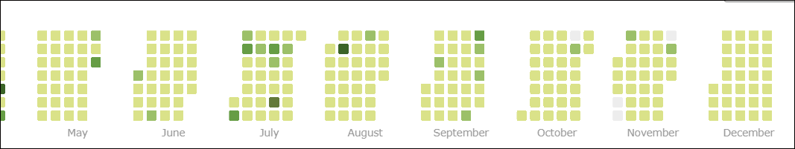

<h1 align="center">Hey there, I'm Sagar Prajapati 👋</h1>

  <b>Junior Data Engineer @ Reknew</b> &nbsp;|&nbsp; Building data pipelines that turn raw data into decisions

  
  &nbsp;
  
  &nbsp;
  
  &nbsp;
  
  &nbsp;
  

---

## About Me

I'm a Data Engineer passionate about transforming complex, messy data into meaningful insights. Currently working at **Reknew**, I build reliable data pipelines and enjoy solving challenging problems along the way.

- 🔭 &nbsp;Working on scalable data pipelines and ETL workflows at Reknew
- 🌱 &nbsp;Actively sharpening problem-solving skills on LeetCode & GeeksforGeeks
- 💡 &nbsp;Interested in data architecture, analytics engineering, and distributed systems
- 📫 &nbsp;Reach me at **sagar.cse.579@gmail.com** or connect on [LinkedIn](https://www.linkedin.com/in/sagar--prajapati)

---

## What I Bring to the Table

| | |
|---|---|
| 🔄 | **Data Pipeline Design** — ETL/ELT workflows that are reliable and scalable |
| 📊 | **Dashboarding & Visualization** — Turning numbers into stories stakeholders understand |
| 🧩 | **Problem-Solving Mindset** — Breaking down complex data challenges systematically |
| 🤝 | **Team Collaboration** — Eager to contribute from day one and grow with the team |

---

## Tech Stack

**Languages & Query**
`Python` &nbsp; `SQL`

**Data Engineering**
`Apache Spark` &nbsp; `Airflow` &nbsp; `dbt` &nbsp; `Kafka`

**Databases & Warehouses**
`PostgreSQL` &nbsp; `MySQL` &nbsp; `BigQuery` &nbsp; `Snowflake`

**Cloud & Tools**
`AWS` &nbsp; `GCP` &nbsp; `Docker` &nbsp; `Git`

---

## GitHub Stats

  
  &nbsp;&nbsp;
  

---

  <i>Building reliable data systems, one pipeline at a time.</i>

