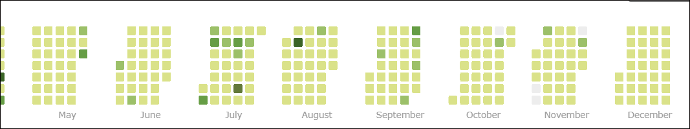

- 👋 Hi, I’m @SagarPrajapati1
- 👀 I’m interested in doing Data Analysis using MS Excel, SQL, Power BI, Python.
- 🌱 Problem Solving is another interesting thing that I am doing. 
- 💞️ I’m looking for an opprtunity in Data Field to apply my all knowledge on tha complex data to get insights from it.
- 📫 You can connect with me on LinkedIn and can direct mail me to my Gmail
- 🚀 What I Bring
    - Data-driven insights that impact business decisions
    - Interactive dashboards that tell compelling stories
    - Problem-solving mindset with continuous learning approach
    - Team collaboration and eagerness to contribute from day one
- LinkedIn www.linkedin.com/in/sagar--prajapati
- Gmail sagar.cse.579@gmail.com@gmail.com
- Twitter https://twitter.com/SPrajapati38128
- Leetcode https://leetcode.com/sagar_789/
- GeeksforGeeks https://auth.geeksforgeeks.org/user/sagar_789

<!---
SagarPrajapati1/SagarPrajapati1 is a ✨ special ✨ repository because its `README.md` (this file) appears on your GitHub profile.
You can click the Preview link to take a look at your changes.
--->
